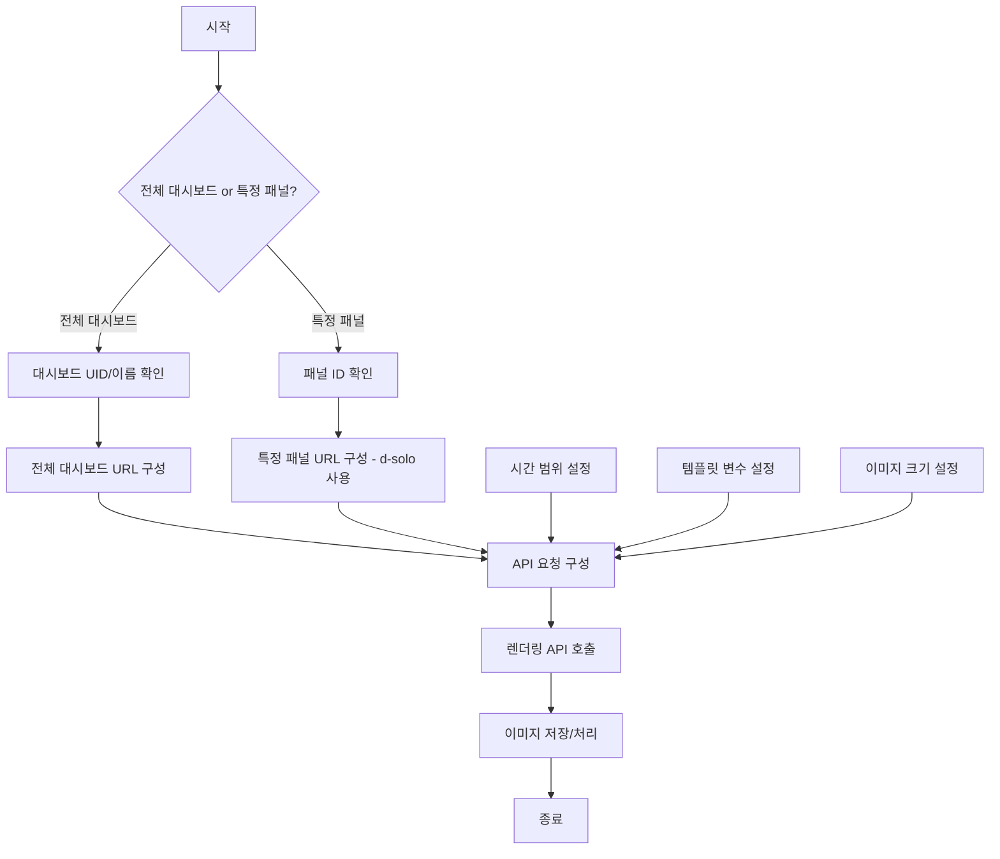

# Grafana 패널 이미지 렌더링 워크플로우

Grafana 대시보드나 특정 패널을 이미지로 렌더링하는 방법과 워크플로우에 대한 가이드입니다.

## 사전 요구사항

- Grafana 이미지 렌더러 설치 필요
- Docker Compose를 사용하는 경우 docker-compose.yml에 다음 설정 필요:

```yaml
# 이미지 렌더러 서비스
renderer:
  image: grafana/grafana-image-renderer:latest
  container_name: grafana-renderer
  ports:
    - "8081:8081"
  environment:
    - ENABLE_METRICS=true
  networks:
    - monitoring-network

# Grafana 서비스 환경 변수에 추가
grafana:
  environment:
    - GF_RENDERING_SERVER_URL=http://renderer:8081/render
    - GF_RENDERING_CALLBACK_URL=http://grafana:3000/
    - GF_LOG_FILTERS=rendering:debug
```

## 워크플로우 다이어그램



## 패널 ID 확인 방법

1. Grafana UI에서 대시보드 접속
2. 원하는 패널의 제목 클릭
3. "편집" 버튼 클릭
4. 브라우저 URL에서 `panelId` 매개변수 확인 또는
5. "Inspector" > "Panel JSON"에서 "id" 값 확인

## URL 구성 예시

### 전체 대시보드 렌더링

```
http://localhost:3000/render/d/spring_boot_21/spring-boot-3-x-statistics
  ?orgId=1
  &from=now-1h
  &to=now
  &var-application=target-api
  &var-instance=target-api:8080
  &width=1920
  &height=1080
```

### 특정 패널 렌더링

```
http://localhost:3000/render/d-solo/spring_boot_21/spring-boot-3-x-statistics
  ?orgId=1
  &from=now-1h
  &to=now
  &panelId=42
  &var-application=target-api
  &var-instance=target-api:8080
  &width=800
  &height=400
```

## 주요 매개변수 설명

| 매개변수 | 설명 | 예시 |
|---------|------|------|
| from | 시작 시간 | now-1h, now-1d, 타임스탬프 |
| to | 종료 시간 | now, 타임스탬프 |
| panelId | 렌더링할 패널 ID | 42 |
| width | 이미지 너비 | 800 |
| height | 이미지 높이 | 400 |
| theme | 테마 | light, dark |
| timeout | 렌더링 타임아웃(초) | 120 |
| var-{name} | 템플릿 변수 | var-application=target-api |

## TypeScript 구현 예시

```typescript
import axios from 'axios';
import fs from 'fs';

async function renderPanel(
  dashboardUid: string, 
  dashboardName: string, 
  panelId: number,
  timeRange: { from: string, to: string },
  variables: Record<string, string>,
  width = 800, 
  height = 400
): Promise<Buffer> {
  // 기본 URL 구성
  const baseUrl = `http://localhost:3000/render/d-solo/${dashboardUid}/${dashboardName}`;
  
  // 템플릿 변수 쿼리 파라미터 구성
  const variablesParams = Object.entries(variables)
    .map(([key, value]) => `var-${key}=${encodeURIComponent(value)}`)
    .join('&');
  
  // 최종 URL 구성
  const url = `${baseUrl}?orgId=1&from=${timeRange.from}&to=${timeRange.to}&panelId=${panelId}&width=${width}&height=${height}&${variablesParams}`;
  
  // API 인증 정보
  const auth = {
    username: 'admin',
    password: 'admin'
  };
  
  // Axios 요청
  const response = await axios.get(url, {
    auth,
    responseType: 'arraybuffer'
  });
  
  return Buffer.from(response.data);
}

// 사용 예시
async function savePanelImage() {
  try {
    const imageBuffer = await renderPanel(
      'spring_boot_21',                  // 대시보드 UID
      'spring-boot-3-x-statistics',      // 대시보드 이름
      42,                                // 패널 ID
      { from: 'now-1h', to: 'now' },     // 시간 범위
      {                                  // 템플릿 변수
        application: 'target-api',
        instance: 'target-api:8080',
        memory_pool_heap: '$__all',
        memory_pool_nonheap: '$__all'
      },
      1000, 500                          // 너비, 높이
    );
    
    // 이미지 저장
    fs.writeFileSync('panel-image.png', imageBuffer);
    console.log('패널 이미지가 저장되었습니다.');
  } catch (error) {
    console.error('패널 렌더링 오류:', error);
  }
}

// 실행
savePanelImage();
```

## curl 명령어 예시

```bash
# 특정 패널 이미지 다운로드
curl -o panel.png -u admin:admin "http://localhost:3000/render/d-solo/spring_boot_21/spring-boot-3-x-statistics?orgId=1&from=now-1h&to=now&panelId=42&width=800&height=400"

# 전체 대시보드 이미지 다운로드
curl -o dashboard.png -u admin:admin "http://localhost:3000/render/d/spring_boot_21/spring-boot-3-x-statistics?orgId=1&from=now-1h&to=now&width=1920&height=1080"
```

## 주의사항

1. 이미지 렌더러가 설치되지 않은 경우 "No image renderer available/installed" 오류 발생
2. 대시보드나 패널이 복잡한 경우 타임아웃 매개변수(`timeout`) 증가 필요
3. 인증 오류가 발생하는 경우 API 키 사용 고려
4. 너무 큰 이미지는 렌더링 실패 가능성 있음 (적절한 크기 설정 필요) 